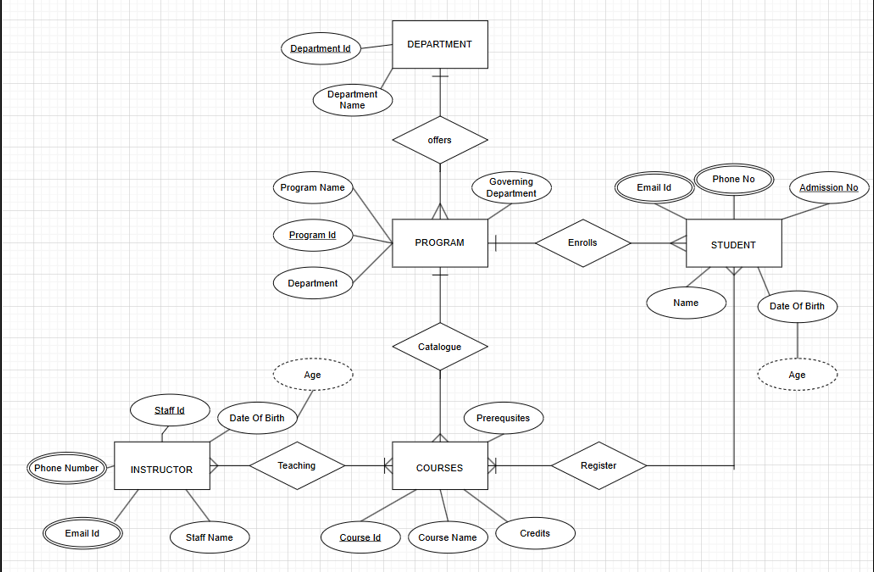

# Experiment 1: Entity-Relationship (ER) Diagram

## 🎯 Objective:
To understand and apply the concepts of ER modeling by creating an ER diagram for a real-world application.

## 📚 Purpose:
The purpose of this workshop is to gain hands-on experience in designing ER diagrams that visually represent the structure of a database including entities, relationships, attributes, and constraints.

---

## 🧪 Choose One Scenario:

### 🔹 Scenario 1: University Database
Design a database to manage students, instructors, programs, courses, and student enrollments. Include prerequisites for courses.

**User Requirements:**
- Academic programs grouped under departments.
- Students have admission number, name, DOB, contact info.
- Instructors with staff number, contact info, etc.
- Courses have number, name, credits.
- Track course enrollments by students and enrollment date.
- Add support for prerequisites (some courses require others).

---

### 🔹 Scenario 2: Hospital Database
Design a database for patient management, appointments, medical records, and billing.

**User Requirements:**
- Patient details including contact and insurance.
- Doctors and their departments, contact info, specialization.
- Appointments with reason, time, patient-doctor link.
- Medical records with treatments, diagnosis, test results.
- Billing and payment details for each appointment.

---

## 📝 Tasks:
1. Identify entities, relationships, and attributes.
2. Draw the ER diagram using any tool (draw.io, dbdiagram.io, hand-drawn and scanned).
3. Include:
   - Cardinality & participation constraints
   - Prerequisites for University OR Billing for Hospital
4. Explain:
   - Why you chose the entities and relationships.
   - How you modeled prerequisites or billing.

# ER Diagram Submission - Student Name

## Scenario Chosen:
University / Hospital (choose one)

## ER Diagram:

## Entities and Attributes:
__1.__DEPARTMENT:____

DepartmentId,Department Name

__2.__PROGRAM__:__

* Program Id (Primary Key),Program Name,Department 

__3.__COURSES:____

Course Id,Course Name,Credits

__4__.INSTRUCTOR:____

Staff Id,Staff Name,Date Of Birth,Phone Number,Email Id
...

## Relationships and Constraints:
___1._DEPARTMENT – offers – PROGRAM____

* Cardinality: One-to-Many
* Participation: Total (each program belongs to exactly one department)

__2.PROGRAM enrolls STUDENT__

* Cardinality: Many-to-Many

* Participation: Partial (a student can be enrolled in multiple programs, but not every student belongs to a program)

__3. COURSES catalog PROGRAM__

* Cardinality: Many-to-One

* Participation: Total (every course must be associated with a program)

__4. STUDENT registers for COURSES__

* Cardinality: Many-to-Many

* Participation: Partial

__5. INSTRUCTOR teaches COURSES__

* Cardinality: Many-to-Many

* Participation: Partial

__6. COURSES have prerequisites__
* Cardinality: Many-to-Many

* Participation: Partial ...

## Extension (Prerequisite / Billing):
* Prerequisites: Modeled as a recursive relationship on the COURSES entity. This allows the definition of a course depending on other course(s) for enrollment eligibility.

* Billing: Not present in the diagram. To model billing, a new entity such as BILLING can be introduced, related to STUDENT and possibly PROGRAM or COURSES with attributes like Amount, Due Date, Status.

## Design Choices:
* Normalization: Entities are well-normalized (1NF at minimum) with clear primary keys and atomic attributes.

* Separation of Roles: Entities like STUDENT and INSTRUCTOR are distinct, reflecting different roles.

* Flexibility: Use of recursive and many-to-many relationships (e.g., Prerequisites, Register) enhances flexibility for real-world academic structures.

* Attributes like Age: Modeled as derived from Date Of Birth, represented with dashed ovals.

## RESULT
Thus, to understand and apply the concepts of ER modeling by creating an ER diagram for a real-world application has been done successfully.