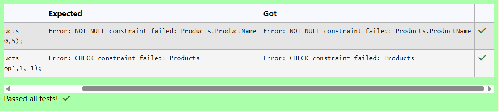
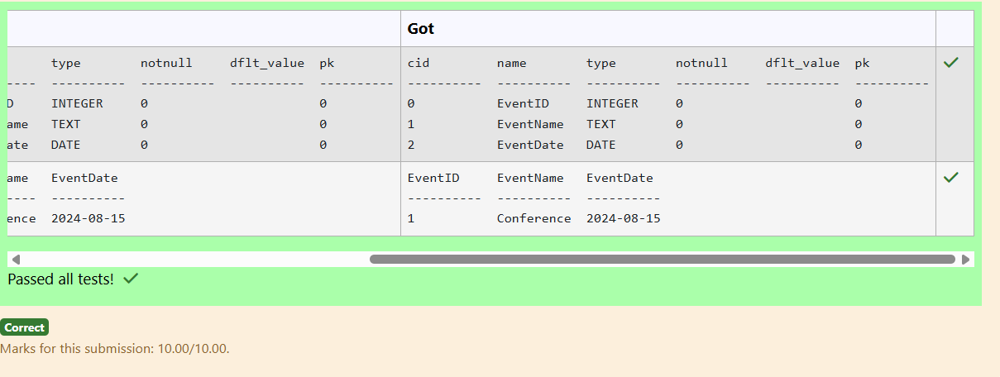
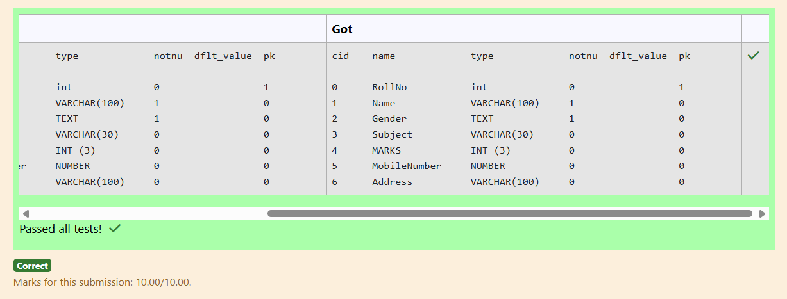
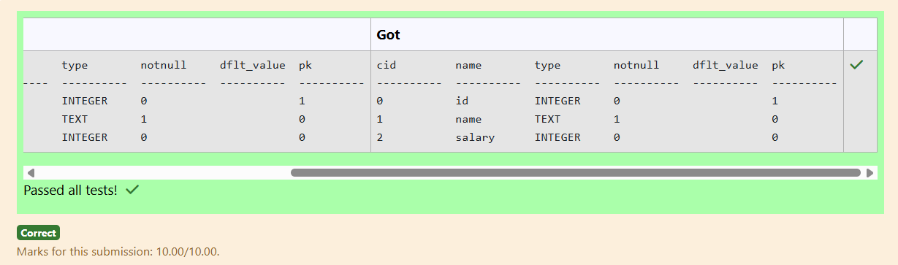
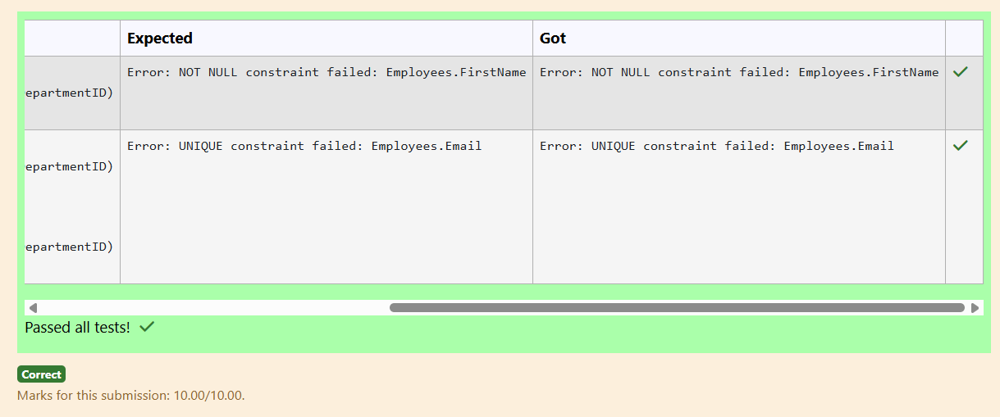
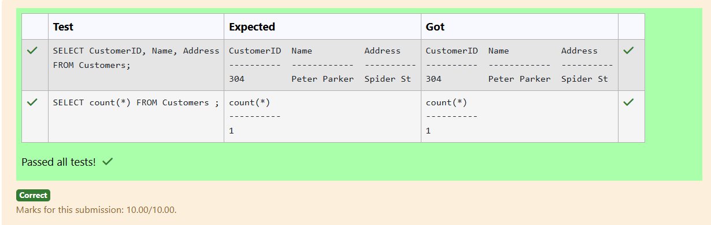
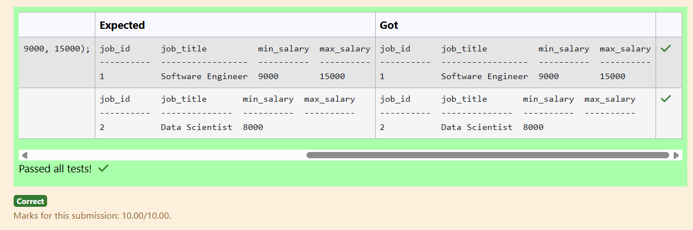
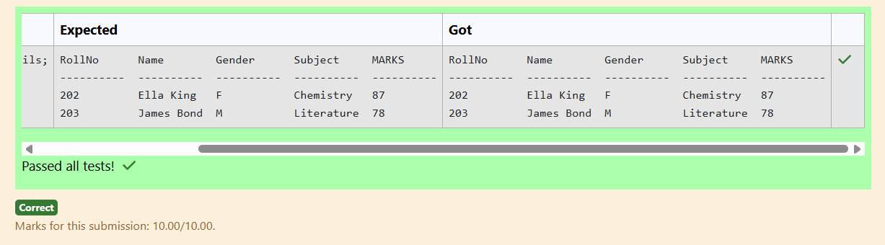
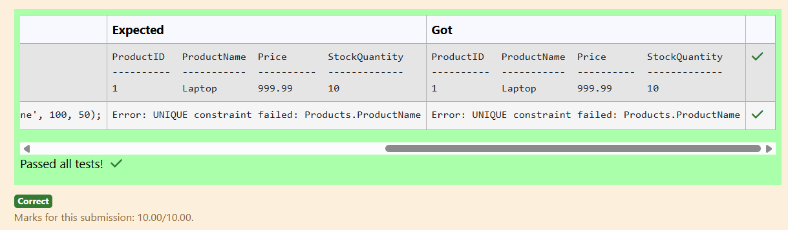
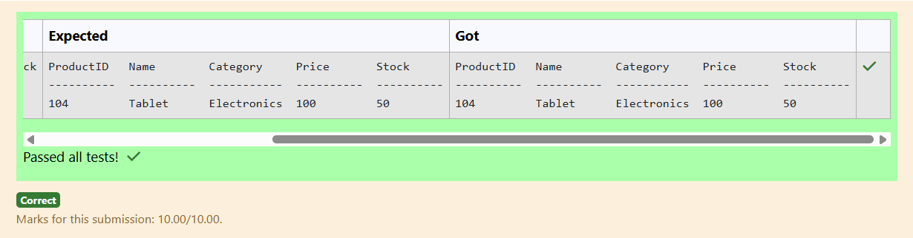

# Experiment 2: DDL Commands

## AIM
To study and implement DDL commands and different types of constraints.

## THEORY

### 1. CREATE
Used to create a new relation (table).

**Syntax:**
```sql
CREATE TABLE (
  field_1 data_type(size),
  field_2 data_type(size),
  ...
);
```
### 2. ALTER
Used to add, modify, drop, or rename fields in an existing relation.
(a) ADD
```sql
ALTER TABLE std ADD (Address CHAR(10));
```
(b) MODIFY
```sql
ALTER TABLE relation_name MODIFY (field_1 new_data_type(size));
```
(c) DROP
```sql
ALTER TABLE relation_name DROP COLUMN field_name;
```
(d) RENAME
```sql
ALTER TABLE relation_name RENAME COLUMN old_field_name TO new_field_name;
```
### 3. DROP TABLE
Used to permanently delete the structure and data of a table.
```sql
DROP TABLE relation_name;
```
### 4. RENAME
Used to rename an existing database object.
```sql
RENAME TABLE old_relation_name TO new_relation_name;
```
### CONSTRAINTS
Constraints are used to specify rules for the data in a table. If there is any violation between the constraint and the data action, the action is aborted by the constraint. It can be specified when the table is created (using CREATE TABLE) or after it is created (using ALTER TABLE).
### 1. NOT NULL
When a column is defined as NOT NULL, it becomes mandatory to enter a value in that column.
Syntax:
```sql
CREATE TABLE Table_Name (
  column_name data_type(size) NOT NULL
);
```
### 2. UNIQUE
Ensures that values in a column are unique.
Syntax:
```sql
CREATE TABLE Table_Name (
  column_name data_type(size) UNIQUE
);
```
### 3. CHECK
Specifies a condition that each row must satisfy.
Syntax:
```sql
CREATE TABLE Table_Name (
  column_name data_type(size) CHECK (logical_expression)
);
```
### 4. PRIMARY KEY
Used to uniquely identify each record in a table.
Properties:
Must contain unique values.
Cannot be null.
Should contain minimal fields.
Syntax:
```sql
CREATE TABLE Table_Name (
  column_name data_type(size) PRIMARY KEY
);
```
### 5. FOREIGN KEY
Used to reference the primary key of another table.
Syntax:
```sql
CREATE TABLE Table_Name (
  column_name data_type(size),
  FOREIGN KEY (column_name) REFERENCES other_table(column)
);
```
### 6. DEFAULT
Used to insert a default value into a column if no value is specified.

Syntax:
```sql
CREATE TABLE Table_Name (
  col_name1 data_type,
  col_name2 data_type,
  col_name3 data_type DEFAULT 'default_value'
);
```

**Question 1**
Create a table named Products with the following constraints:

* ProductID should be the primary key.
* ProductName should be NOT NULL.
* Price is of real datatype and should be greater than 0.
Stock is of integer datatype and should be greater than or equal to 0.

```sql
CREATE TABLE Products(ProductID PRIMARY KEY,ProductName NOT NULL,Price real check(price>0),Stock INTEGER CHECK(Stock>=0));
```

**Output:**



**Question 2**
---
Create a table named Events with the following columns:

* EventID as INTEGER
* EventName as TEXT
* EventDate as DATE

```sql
CREATE TABLE Events(EventID INTEGER,EventName TEXT,EventDate DATE);
```

**Output:**



**Question 3**
---
Write a SQL query to add a new column MobileNumber of type NUMBER and a new column Address of type VARCHAR(100) to the Student_details table.

```sql
ALTER TABLE Student_details
add column MobileNumber NUMBER;
ALTER TABLE student_details
add column Address VARCHAR(100);
```

**Output:**


**Question 4**
---
Write an SQL query to add a new column salary of type INTEGER to the Employees table, with a CHECK constraint that ensures the value in this column is greater than 0.

```sql
ALTER TABLE Employees
add column salary INTEGER check(salary>0);
```

**Output:**


**Question 5**
---
Create a table named Employees with the following constraints:

* EmployeeID should be the primary key.
* FirstName and LastName should be NOT NULL.
* Email should be unique.
* Salary should be greater than 0.
* DepartmentID should be a foreign key referencing the Departments table.

```sql
CREATE TABLE Employees(
EmployeeID integer PRIMARY KEY,
FirstName varchar(100) not null,
LastName varchar(100) not null,
Email varchar(100) unique,
Salary decimal check(Salary>0),
DepartmentID integer,
foreign key (DepartmentID) references Departments(DepartmentID)
);
```

**Output:**


**Question 6**
---
Insert the below data into the Customers table, allowing the City and ZipCode columns to take their default values.
<pre>
CustomerID  Name          Address
----------  ------------  ----------
304         Peter Parker  Spider St      

Note: The City and ZipCode columns will use their default values.
</pre>
```sql
INSERT INTO Customers(CustomerID,Name,Address) VALUES(304,'Peter Parker','Spider St');
```

**Output:**



**Question 7**
---
create a table named jobs including columns job_id, job_title, min_salary and max_salary, and make sure that, the default value for job_title is blank and min_salary is 8000 and max_salary is NULL will be entered automatically at the time of insertion if no value assigned for the specified columns.

```sql
CREATE TABLE jobs(
job_id int PRIMARY KEY,
job_title varchar(225) default'',
min_salary int default 8000,
max_salary int default null
);
```

**Output:**



**Question 8**
---
Insert the following students into the Student_details table:
<pre>
RollNo      Name        Gender      Subject     MARKS
----------  ----------  ----------  ----------  ----------
202            Ella King         F           Chemistry   87
203            James Bond   M          Literature    78
</pre>
```sql
insert into Student_details(RollNo,Name,Gender,Subject,MARKS)VALUES(202,'Ella King','F','Chemistry',87),(203,'James Bond','M','Literature',78);
```

**Output:**


**Question 9**
---
Create a table named Products with the following constraints:
* ProductID as INTEGER should be the primary key.
* ProductName as TEXT should be unique and not NULL.
* Price as REAL should be greater than 0.
* StockQuantity as INTEGER should be non-negative.
For example:

```sql
CREATE TABLE Products(ProductID INTEGER PRIMARY KEY,ProductName TEXT unique NOT NULL,Price REAL CHECK(PRICE>0),StockQuantity INTEGER check(StockQuantity>0));
```

**Output:**



**Question 10**
---
Insert a product with ProductID 104, Name Tablet, and Category Electronics into the Products table, where Price and Stock should use default values.

```sql
INSERT into ProductS(ProductID,Name,Category,Price,Stock)values(104,'Tablet','Electronics',100,'50');
```

**Output:**



## RESULT
Thus, the SQL queries to implement different types of constraints and DDL commands have been executed successfully.
