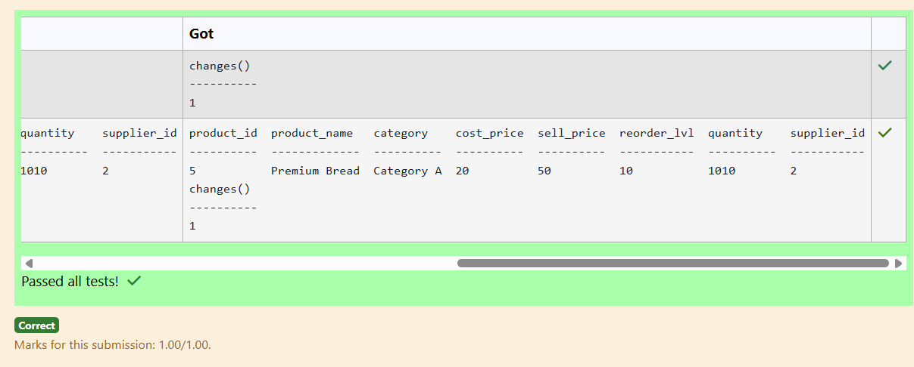

# Experiment 3: DML Commands

## AIM
To study and implement DML (Data Manipulation Language) commands.

## THEORY

### 1. INSERT INTO
Used to add records into a relation.
These are three type of INSERT INTO queries which are as
A)Inserting a single record
**Syntax (Single Row):**
```sql
INSERT INTO table_name (field_1, field_2, ...) VALUES (value_1, value_2, ...);
```
**Syntax (Multiple Rows):**
```sql
INSERT INTO table_name (field_1, field_2, ...) VALUES
(value_1, value_2, ...),
(value_3, value_4, ...);
```
**Syntax (Insert from another table):**
```sql
INSERT INTO table_name SELECT * FROM other_table WHERE condition;
```
### 2. UPDATE
Used to modify records in a relation.
Syntax:
```sql
UPDATE table_name SET column1 = value1, column2 = value2 WHERE condition;
```
### 3. DELETE
Used to delete records from a relation.
**Syntax (All rows):**
```sql
DELETE FROM table_name;
```
**Syntax (Specific condition):**
```sql
DELETE FROM table_name WHERE condition;
```
### 4. SELECT
Used to retrieve records from a table.
**Syntax:**
```sql
SELECT column1, column2 FROM table_name WHERE condition;
```
**Question 1**
--
Write a SQL statement to change the EMAIL and COMMISSION_PCT column of the following EMPLOYEES table with 'not available' and 0.55 for those employees whose DEPARTMENT_ID is 110.
<pre>
Employees table

---------------
employee_id
first_name
last_name
email
phone_number
hire_date
job_id
salary
commission_pct
manager_id
department_id
</pre>

```sql
update Employees
set email = 'not available',COMMISSION_PCT = 0.55 where DEPARTMENT_ID = 110;
```

**Output:**


**Question 2**

Write a SQL statement to Update the product_name to 'Premium Bread' whose product ID is 5 in the products table.
<pre>
Products table

---------------
product_id
product_name
category
cost_price
sell_price
reorder_lvl
quantity
supplier_id
</pre>
```sql
UPDATE Products 
set product_name = 'Premium Bread'
where product_id = 5;
```

**Output:**



**Question 3**
---
Write a SQL statement to Update the hire_date of employees in department 50 to 2024-01-24.
<pre>
Employees table

---------------
employee_id
first_name
last_name
email
phone_number
hire_date
job_id
salary
commission_pct
manager_id
department_id
</pre>
```sql
UPDATE Employees
set hire_date = '2024-01-24'
where department_id = 50;
```

**Output:**


**Question 4**
---
Write a SQL statement to Double the salary for employees in department 20 who have a job_id ending with 'MAN'
<pre>
Employees table

---------------
employee_id
first_name
last_name
email
phone_number
hire_date
job_id
salary
commission_pct
manager_id
department_id
</pre>
```sql
update Employees set salary = salary * 2
where department_id = 20 and job_id like '%MAN';
```

**Output:**


**Question 5**
---
Write a SQL query to Delete customers with following conditions

* 'CUST_COUNTRY' is not in a list of specified countries ('UK',
 * 'USA', 'Canada')
* 'GRADE' is greater than or equal to 3

```sql
delete from customer 
where CUST_COUNTRY NOT IN ('UK','USA','canada')
and grade >= 3;
```

**Output:**


**Question 6**
---
Write a SQL query to Delete customers from 'customer' table where 'OPENING_AMT' is between 4000 and 6000.

```sql
delete from customer 
where OPENING_AMT BETWEEN 4000 AND 6000;
```

**Output:**


**Question 7**
---
Write a SQL query to Delete customers from 'customer' table where 'WORKING_AREA' is 'New York'.

```sql
DELETE from  customer 
where WORKING_AREA = 'New York'
```

**Output:**


**Question 8**
---
Write a SQL query to Delete All Doctors whose ID ranges from 2 to 4.

Sample table: Doctors

attributes : doctor_id, first_name, last_name, specialization

```sql
delete from Doctors
where doctor_id between 2 and 4;
```

**Output:**


**Question 9**
---
Write a SQL query to Delete customers whose 'GRADE' is greater than 2 and have a 'PAYMENT_AMT' less than the average 'PAYMENT_AMT' for all customers, or whose 'OUTSTANDING_AMT' is greater than 8000:

```sql
delete from customer 
where (GRADE > 2 AND PAYMENT_AMT < (SELECT AVG (PAYMENT_AMT) FROM CUSTOMER))
OR OUTSTANDING_AMT > 8000;
```

**Output:**


**Question 10**
---
Write a SQL query to Select all patients who were admitted during the year 2023.
<pre>
Table: Patients

name                  type
--------------------  ----------
patient_id            INT
first_name            VARCHAR(50)
last_name             VARCHAR(50)
date_of_birth         DATE
admission_date        DATE
discharge_date        DATE
doctor_id             INT
</pre>
```sql
SELECT patient_id, first_name, admission_date
FROM Patients
where strftime('%Y',
admission_date) = '2023';
```

**Output:**


## RESULT
Thus, the SQL queries to implement DML commands have been executed successfully.
