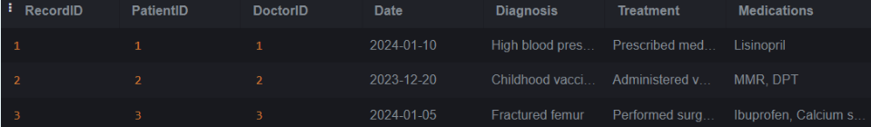
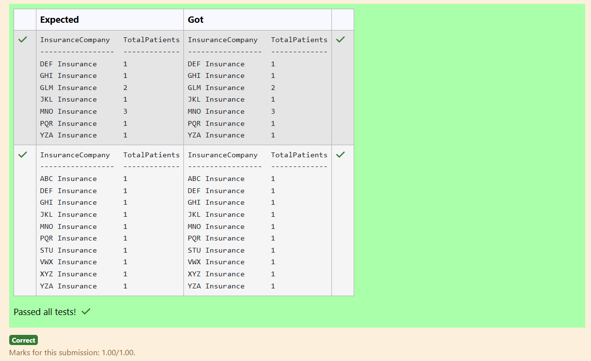
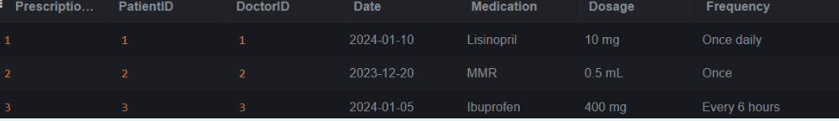
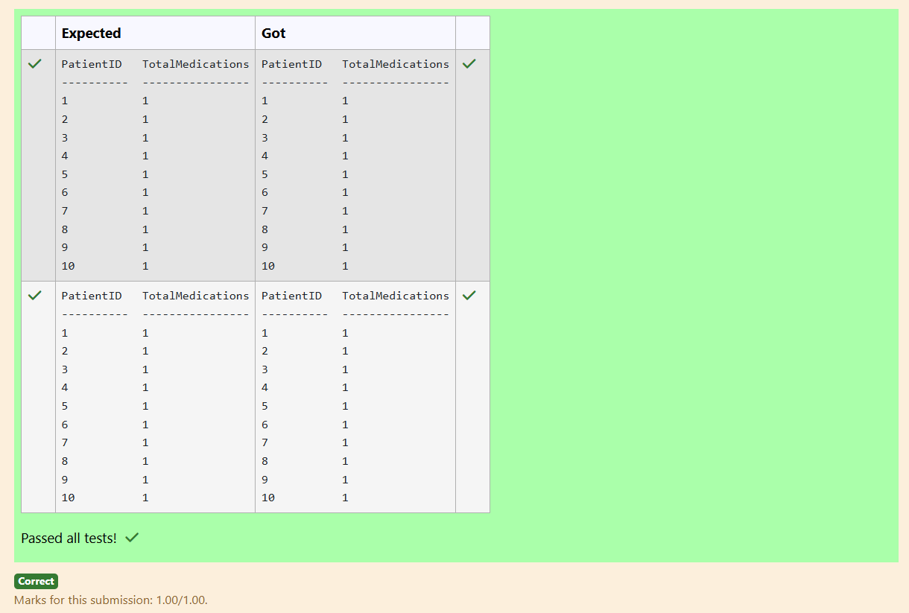

# Experiment 4: Aggregate Functions, Group By and Having Clause

## AIM
To study and implement aggregate functions, GROUP BY, and HAVING clause with suitable examples.

## THEORY

### Aggregate Functions
These perform calculations on a set of values and return a single value.

- **MIN()** – Smallest value  
- **MAX()** – Largest value  
- **COUNT()** – Number of rows  
- **SUM()** – Total of values  
- **AVG()** – Average of values

**Syntax:**
```sql
SELECT AGG_FUNC(column_name) FROM table_name WHERE condition;
```
### GROUP BY
Groups records with the same values in specified columns.
**Syntax:**
```sql
SELECT column_name, AGG_FUNC(column_name)
FROM table_name
GROUP BY column_name;
```
### HAVING
Filters the grouped records based on aggregate conditions.
**Syntax:**
```sql
SELECT column_name, AGG_FUNC(column_name)
FROM table_name
GROUP BY column_name
HAVING condition;
```

**Question 1**
--
What is the most common diagnosis among patients?

Sample table:MedicalRecords Table


```sql
select Diagnosis, count(*) as 
DiagnosisCount
from MedicalRecords
group by Diagnosis
order by DiagnosisCount DESC
LIMIT 1 ;
```

**Output:**


**Question 2**
---
What is the count of male and female patients?

Sample table: Patients Table

```sql
SELECT Gender, count(*) as
TotalPatients
from Patients
group by Gender;
```

**Output:**


**Question 3**
How many patients are there in each city?

Sample table: Patients Table


```sql
select Address , count(*) as TotalPatients
from Patients
group by Address; 
```

**Output:**


**Question 4**
---
Write a SQL query to find the total income of employees aged 40 or above.
<pre>
Table: employee

name        type
----------  ----------
id          INTEGER
name        TEXT
age         INTEGER
city        TEXT
income      INTEGER
</pre>
```sql
select SUM(income) as total_income
from employee
where age >=40;
```

**Output:**


**Question 5**
---
Write a SQL query to Calculate the average income of the employees with names starting with 'A': 
<pre>
Table: employee

name        type
----------  ----------
id          INTEGER
name        TEXT
age         INTEGER
city        TEXT
income      INTEGER
</pre>
```sql
select AVG(income) as avg_income
from employee
where name LIKE 'A%';
```

**Output:**


**Question 6**
---
Write a SQL query to find the maximum purchase amount.
<pre>
Sample table: orders

ord_no      purch_amt   ord_date    customer_id  salesman_id

----------  ----------  ----------  -----------  -----------

70001       150.5       2012-10-05  3005         5002

70009       270.65      2012-09-10  3001         5005

70002       65.26       2012-10-05  3002         500
</pre>
```sql
SELECT MAX(purch_amt) as MAXIMUM
FROM orders;
```

**Output:**


**Question 7**
---
Write a SQL query to find the average length of email addresses (in characters):
<[re]>
Table: customer

name        type
----------  ----------
id          INTEGER
name        TEXT
city        TEXT
email       TEXT
phone       INTEGER
</pre>
```sql
SELECT AVG(LENGTH(email)) AS avg_email_length
FROM customer;
```

**Output:**


**Question 8**
---
How many patients are covered by each insurance company?
<pre>
Sample table:Insurance Table

name               type
-----------------  ----------
InsuranceID        INTEGER
PatientID          INTEGER
InsuranceCompany   TEXT
PolicyNumber       TEXT
PolicyHolder       TEXT
ValidityPeriod     TEXT
</pre>
```sql
select InsuranceCompany, COUNT(DISTINCT PatientID)AS TotalPatients
from Insurance
group BY InsuranceCompany
```

**Output:**



**Question 9**
---
What is the total number of medications prescribed for each patient?

Sample tablePrescriptions Table


```sql
select PatientID, COUNT(Medication) as TotalMedications
from Prescriptions
group by PatientID;
```

**Output:**



**Question 10**
---
Write a SQL query to find the minimum purchase amount.
<pre>
Sample table: orders

ord_no      purch_amt   ord_date    customer_id  salesman_id

----------  ----------  ----------  -----------  -----------

70001       150.5       2012-10-05  3005         5002

70009       270.65      2012-09-10  3001         5005

70002       65.26       2012-10-05  3002         5001
</pre>
```sql
select min(purch_amt) as MINIMUM
from orders;
```

**Output:**


## RESULT
Thus, the SQL queries to implement aggregate functions, GROUP BY, and HAVING clause have been executed successfully.
