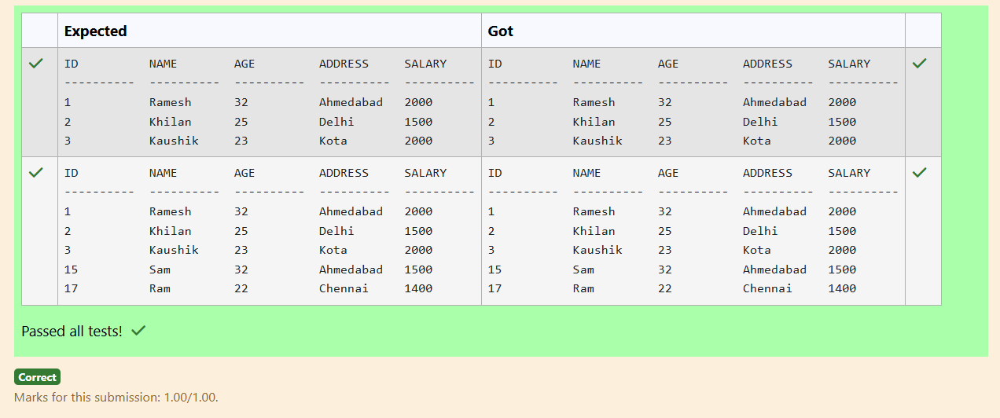
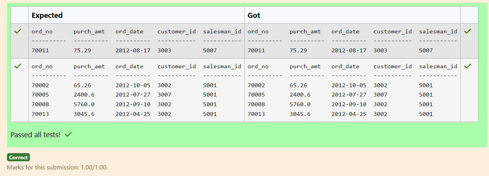
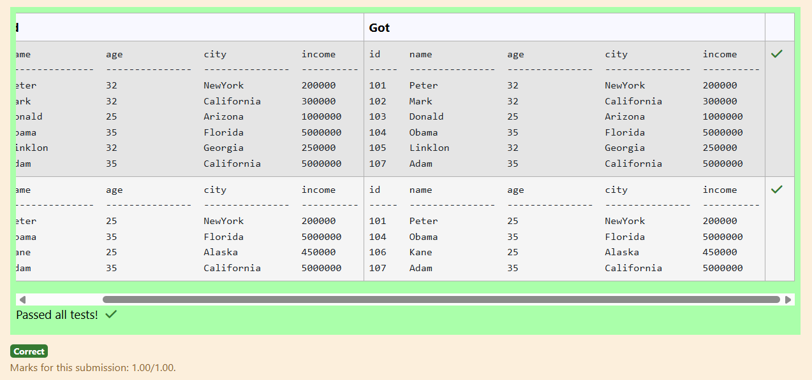
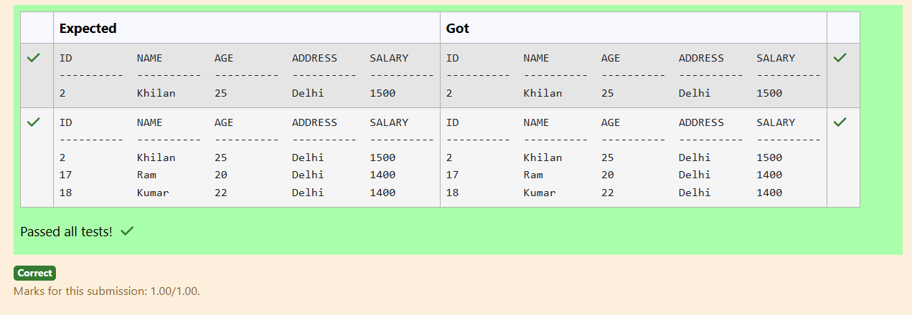
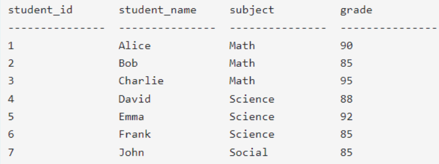
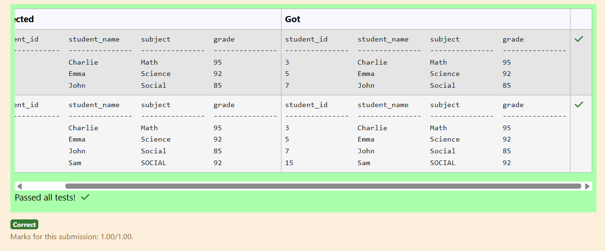
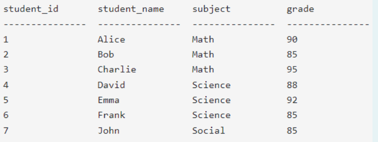
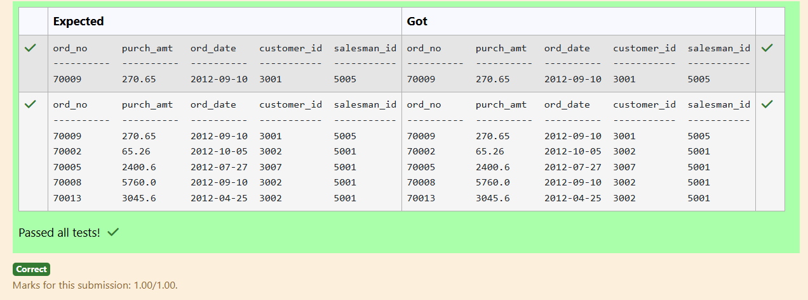
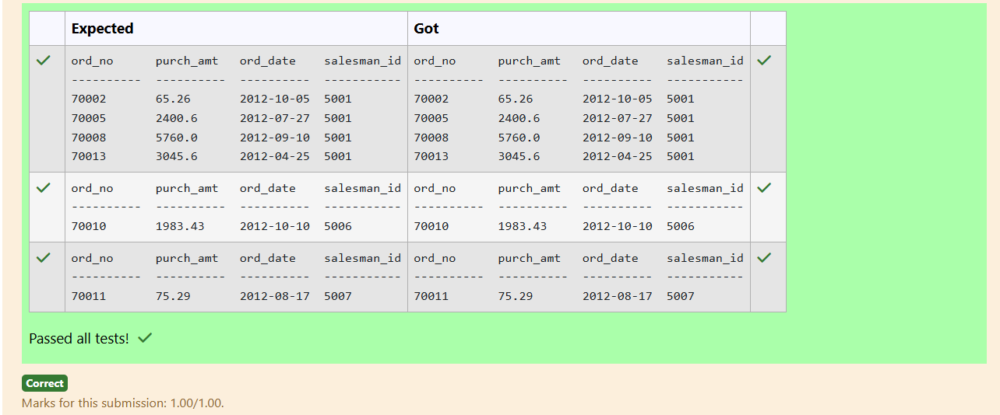
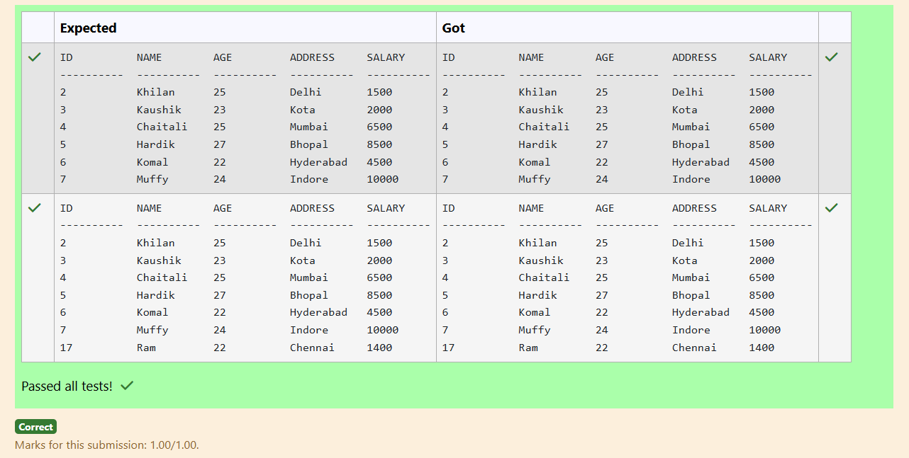

# Experiment 5: Subqueries and Views

## AIM
To study and implement subqueries and views.

## THEORY

### Subqueries
A subquery is a query inside another SQL query and is embedded in:
- WHERE clause
- HAVING clause
- FROM clause

**Types:**
- **Single-row subquery**:
  Sub queries can also return more than one value. Such results should be made use along with the operators in and any.
- **Multiple-row subquery**:
  Here more than one subquery is used. These multiple sub queries are combined by means of ‘and’ & ‘or’ keywords.
- **Correlated subquery**:
  A subquery is evaluated once for the entire parent statement whereas a correlated Sub query is evaluated once per row processed by the parent statement.

**Example:**
```sql
SELECT * FROM employees
WHERE salary > (SELECT AVG(salary) FROM employees);
```
### Views
A view is a virtual table based on the result of an SQL SELECT query.
**Create View:**
```sql
CREATE VIEW view_name AS
SELECT column1, column2 FROM table_name WHERE condition;
```
**Drop View:**
```sql
DROP VIEW view_name;
```

**Question 1**

From the following tables, write a SQL query to find all orders generated by the salespeople who may work for customers whose id is 3007. Return ord_no, purch_amt, ord_date, customer_id, salesman_id.

<pre>
Table Name: orders

name             type
---------------  --------
order_no         int
purch_amt        real
order_date       text
customer_id      int
salesman_id      int
</pre>

sql

SELECT ord_no, purch_amt, ord_date, customer_id, salesman_id
FROM orders
WHERE salesman_id IN (
    SELECT salesman_id
    FROM orders
    WHERE customer_id = 3007
);

**Output:**
ere
**Question 2**
---
Write a SQL query to retrieve all columns from the CUSTOMERS table for customers whose salary is LESS than $2500.
<pre>
Sample table: CUSTOMERS

ID          NAME        AGE         ADDRESS     SALARY
----------  ----------  ----------  ----------  ----------

1          Ramesh     32              Ahmedabad     2000
2          Khilan        25              Delhi                 1500
3          Kaushik      23              Kota                  2000
4          Chaitali       25             Mumbai            6500
5          Hardik        27              Bhopal              8500
6          Komal         22              Hyderabad       4500

7           Muffy          24              Indore            10000
</pre>
```sql
SELECT *
FROM CUSTOMERS
WHERE SALARY < 2500;
```

**Output:**


**Question 3**
---
From the following tables, write a SQL query to find all the orders issued by the salesman 'Paul Adam'. Return ord_no, purch_amt, ord_date, customer_id and salesman_id.
<pre>
salesman table

name             type
---------------  ---------------
salesman_id      numeric(5)
name                 varchar(30)
city                    varchar(15)
commission       decimal(5,2)

orders table

name             type
---------------  --------
order_no         int
purch_amt        real
order_date       text
customer_id      int
salesman_id      int
</pre>
```sql
SELECT ord_no, purch_amt, ord_date, customer_id, salesman_id
FROM orders
WHERE salesman_id = (
    SELECT salesman_id
    FROM salesman
    WHERE name = 'Paul Adam'
);
```

**Output:**



**Question 4**
---
Write a SQL query to Find employees who have an age less than the average age of employees with incomes over 2.5 Lakh
<pre>
Employee Table

name             type

------------   ---------------

id                    INTEGER

name              TEXT

age                 INTEGER

city                 TEXT

income           INTEGER
</pre>
```sql
SELECT *
FROM Employee
WHERE age < (
    SELECT AVG(age)
    FROM Employee
    WHERE income > 250000
);

```

**Output:**



**Question 5**
---
Write a SQL query to retrieve all columns from the CUSTOMERS table for customers whose Address as Delhi and age below 30
<pre>
Sample table: CUSTOMERS

ID          NAME        AGE         ADDRESS     SALARY
----------  ----------  ----------  ----------  ----------

1          Ramesh     32              Ahmedabad     2000
2          Khilan        25              Delhi                 1500
3          Kaushik      23              Kota                  2000
4          Chaitali       25             Mumbai            6500
5          Hardik        27              Bhopal              8500
6          Komal         22              Hyderabad       4500

7           Muffy          24              Indore            10000
</pre>
```sql
select *
from CUSTOMERS
WHERE ADDRESS = 'Delhi' AND  AGE < 30
ORDER BY ID;
```

**Output:**


**Question 6**
---
Write a SQL query that retrieve all the columns from the table "Grades", where the grade is equal to the maximum grade achieved in each subject.

Sample table: GRADES (attributes: student_id, student_name, subject, grade)


```sql
SELECT *
FROM Grades g
WHERE grade = (
    SELECT MAX(grade)
    FROM Grades
    WHERE subject = g.subject
);
```

**Output:**



**Question 7**
---
Write a SQL query that retrieves the names of students and their corresponding grades, where the grade is equal to the minimum grade achieved in each subject.

Sample table: GRADES (attributes: student_id, student_name, subject, grade)


```sql
SELECT student_name, grade
from GRADES g
WHERE grade = (
SELECT MIN(grade)
    FROM Grades
    WHERE subject = g.subject
);
```

**Output:**


**Question 8**
---
From the following tables write a SQL query to find all orders generated by London-based salespeople. Return ord_no, purch_amt, ord_date, customer_id, salesman_id.
<pre>
salesman table

name             type
---------------  ---------------
salesman_id      numeric(5)
name                 varchar(30)
city                    varchar(15)
commission       decimal(5,2)

orders table

name             type
---------------  --------
order_no         int
purch_amt        real
order_date       text
customer_id      int
salesman_id      int
</pre>
```sql
SELECT ord_no, purch_amt, ord_date, customer_id, salesman_id
FROM orders
WHERE salesman_id IN (
    SELECT salesman_id
    FROM salesman
    WHERE city = 'London'
);
```

**Output:**


**Question 9**
---
From the following tables, write a SQL query to find those salespeople who earned the maximum commission. Return ord_no, purch_amt, ord_date, and salesman_id.
<pre>
salesman table

name             type
---------------  ---------------
salesman_id      numeric(5)
name                 varchar(30)
city                    varchar(15)
commission       decimal(5,2)

orders table

name             type
---------------  --------
order_no         int
purch_amt        real
order_date       text
customer_id      int
salesman_id      int
</pre>
```sql
SELECT ord_no AS ord_no, purch_amt, ord_date AS ord_date, salesman_id
FROM orders
WHERE salesman_id IN (
    SELECT salesman_id
    FROM salesman
    WHERE commission = (
        SELECT MAX(commission)
        FROM salesman
    )
);
```

**Output:**



**Question 10**
---
Write a SQL query to retrieve all columns from the CUSTOMERS table for customers whose AGE is LESS than $30
<pre>
Sample table: CUSTOMERS

ID          NAME        AGE         ADDRESS     SALARY
----------  ----------  ----------  ----------  ----------

1          Ramesh     32              Ahmedabad     2000
2          Khilan        25              Delhi                 1500
3          Kaushik      23              Kota                  2000
4          Chaitali       25             Mumbai            6500
5          Hardik        27              Bhopal              8500
6          Komal         22              Hyderabad       4500

7           Muffy          24              Indore            10000
</pre>
```sql
select *
from CUSTOMERS
WHERE AGE < 30;
```

**Output:**




## RESULT
Thus, the SQL queries to implement subqueries and views have been executed successfully.
